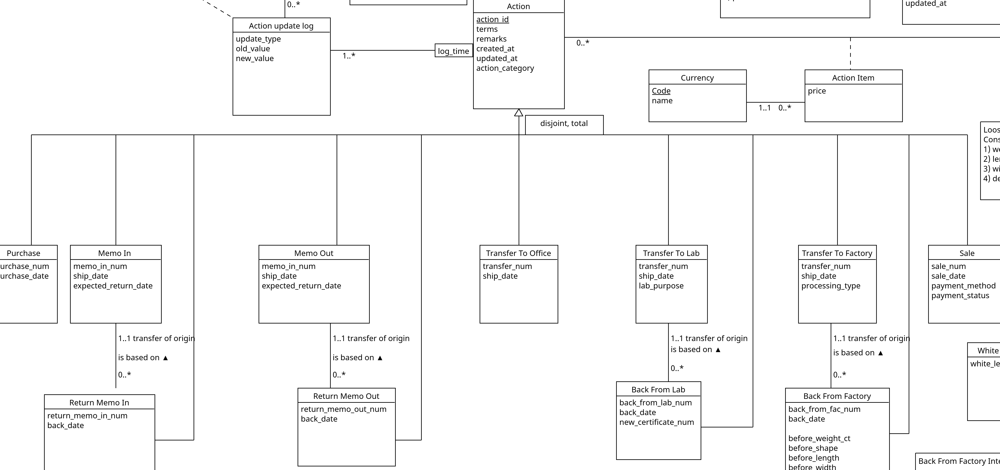
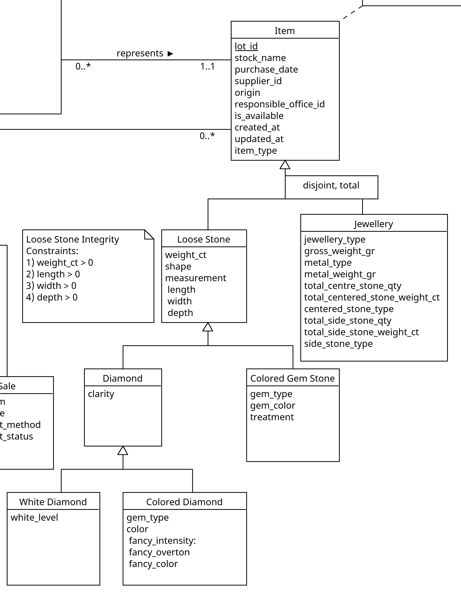

# Inventory management system for diamonds, colored stones, and jewelries

## Authors: Liao Pei-Wen, Makovskyi Maksym, Wu Guo Yu

---

# What problem we are trying to solve ? (1)

Companies in the diamond and precious stone sector face several operational challenges:

- Paper-based processes that create delays and errors.
- Fragmented spreadsheets create duplicates, slow searches, and inventory errors.
- Limited traceability (certificates, provenance) increases audit and compliance risk.

---

# What problem we are trying to solve ? (2)

### Lot Concept

- either a single diamond or gemstone
- or a single piece of jewelry.

Each lot is characterized by:

- A controlled status, belonging to a predefined and validated set of states
- A current location, which may be an internal office or an external partner
- An item category (diamond, gemstone, or jewelry)
- A purchase date and, when applicable, a sale date
- A linked counterparty (supplier, client, laboratory, or manufacturer)
- Financial information associated with the lot through commercial documents

---

# What problem we are trying to solve ? (3)

### Inventory Lifecycle is driven by real world operations

- Purchase Note
- Memo In
- Return Memo In
- Memo Out
- Return Memo Out
- Transfer records
- Return Transfer records
- Invoice

---

<style scoped>
p { text-align: center; }
</style>

# Conceptual schema (1)

#### `action`



--- 

<style scoped>
p { text-align: center; }
</style>

# Conceptual schema (2)

#### `item`



---

# Conceptual schema (3)

Return style actions

---

# Conceptual schema (4)

Link between Action and Item

---

# Conceptual schema (5)

Link between Counterpart and Account type

---

# Conceputal schema (6)

Employee and Action

---

# Conceptual schema (7)

Certificate

---

# Relation schema (1)

#### `item` related relations

_item_ (**lot_id**, stock_name, purchase_date, supplier_id, origin, responsible_office_id, created_at, updated_at, is_available, item_type)
`supplier_id` references `counterpart.counterpart_id` NOT NULL
`responsible_office_id` references `counterpart.counterpart_id` NOT NULL
_loose_stone_ (**lot_id**, weight_ct, shape, length, width, depth)
`lot_id` references `item.lot_id`
_white_diamond_ (**lot_id**, white_level, clarity)
`lot_id` references `loose_stone.lot_id`

---

# Relation schema (2)

#### `action` related relations

_action_ (**action_id**, from_counterpart_id, to_counterpart_id, terms, remarks, created_at, updated_at, action_category)
`from_counterpart_id` references `counterpart.counterpart_id` NOT NULL
`to_counterpart_id` references `counterpart.counterpart_id` NOT NULL
_purchase_ (**action_id**, purchase_num, purchase_date)
`action_id` references `action.action_id`
_transfer_to_office_ (**action_id**, transfer_num, ship_date)
`action_id` references `action.action_id`
_sale_ (**action_id**, sale_num, sale_date, payment_method, payment_status)
`action_id` references `action.action_id`

---

# Relation schema (3)

#### return-style `action`

_transfer_to_lab_ (**action_id**, transfer_num, ship_date, lab_purpose)
`action_id` references `action.action_id`
_back_from_lab_ (**action_id**, orig_transfer_id, back_from_lab_num, back_date, new_certificate_num)
`action_id` references `action.action_id`
`orig_transfer_id` references `transfer_to_lab.action_id` NOT NULL
`new_certificate_num` references `certificate.certificate_num` NOT NULL

---

# Relation schema (4)

#### Link between `action` and `item`

_action_item_ (**action_id, lot_id**, price, currency_code)
`action_id` references `action.action_id`
`lot_id` references `item.lot_id`
`currency_code` references `currency.code` NOT NULL

---

# Relation schema (5)

#### Link between `employee` and `action`

_employee_ (**employee_id**, counterpart_id, first_name, last_name, email, role, is_active, created_at, updated_at)
`counterpart_id` references `counterpart.counterpart_id` NOT NULL
_action_update_log_ (**log_time, action_id**, employee_id, update_type, old_value, new_value, log_time)
`action_id` references `action.action_id`
`employee_id` references `employee.employee_id` NOT NULL

---

# Relation schema (6)

#### `counterpart` related relations

_counterpart_ (**counterpart_id**, name, phone_number, address_short, city, postal_code, country, email, is_active, created_at, updated_at)
_account_type_ (**type_name**, category, is_internal)
_counterpart_account_type_ (**counterpart_id, type_name**)
`counterpart_id` references `counterpart.counterpart_id`
`type_name` references `account_type.type_name`

---

# Relation schema (7)

#### `certificate`

_certificate_(**certificate_num**, lot_id, lab_id, issue_date, shape, weight_ct, length, width, depth, clarity, color, treatment, gem_type, is_valid, created_at, updated_at)
`lot_id` references `item.lot_id` NOT NULL
`lab_id` references `counterpart.counterpart_id` NOT NULL

---

# SQL (1)

#### 'Inventory by type' view (part 1)

```SQL
CREATE OR REPLACE VIEW inventory_by_type AS
SELECT CASE
           WHEN wd.lot_id IS NOT NULL THEN 'White Diamond'
           WHEN cd.lot_id IS NOT NULL THEN 'Colored Diamond'
           WHEN cgs.lot_id IS NOT NULL THEN 'Colored Gemstone'
           WHEN j.lot_id IS NOT NULL THEN 'Jewelry'
           ELSE 'Unknown'
           END                                                 AS item_tp,
       COUNT(*)                                                AS total_count,
       SUM(CASE WHEN i.is_available = TRUE THEN 1 ELSE 0 END)  AS available_count,
       SUM(CASE WHEN i.is_available = FALSE THEN 1 ELSE 0 END) AS unavailable_count,
       ROUND(SUM(COALESCE(ls.weight_ct, 0))::NUMERIC, 2)       AS total_weight_ct,
       ROUND(AVG(COALESCE(ls.weight_ct, 0))::NUMERIC, 2)       AS avg_weight_ct
FROM -- part 2 next slide
```

--- 

# SQL (2)

#### 'Inventory by type' view (`FROM` part)

```SQL
CREATE OR REPLACE VIEW inventory_by_type AS
SELECT
  -- part 1 prev slide
  FROM item i
       LEFT JOIN loose_stone ls
       ON i.lot_id = ls.lot_id
       LEFT JOIN white_diamond wd
       ON ls.lot_id = wd.lot_id
       LEFT JOIN colored_diamond cd
       ON ls.lot_id = cd.lot_id
       LEFT JOIN colored_gem_stone cgs
       ON ls.lot_id = cgs.lot_id
       LEFT JOIN jewelry j
       ON i.lot_id = j.lot_id
 GROUP BY item_tp
 ORDER BY total_count DESC;
```

---

# SQL (3)

#### 'Keep track of availability and location' trigger (part 1)

```SQL
CREATE OR REPLACE FUNCTION trig_a_i_keep_track_responsible_office()
    RETURNS TRIGGER AS
$$
DECLARE
    counterpart_col_name text;
    item_availability bool;
    dynamic_sql text;
BEGIN
    IF TG_TABLE_NAME IN ('return_memo_out', 'back_from_factory', 'back_from_lab') THEN
        counterpart_col_name := 'to_counterpart_id';
        item_availability := TRUE;
    ELSIF TG_TABLE_NAME IN ('return_memo_in', 'memo_out', 'transfer_to_factory', 'transfer_to_lab', 'sale') THEN
        counterpart_col_name := 'from_counterpart_id';
        item_availability := FALSE;
    ELSE -- transfer_to_office
        counterpart_col_name := 'to_counterpart_id';
        item_availability := TRUE;
    END IF;
    -- part 2 next slide
    RETURN new;
END;
$$ LANGUAGE plpgsql;
```

---

# SQL (4)

#### 'Keep track of availability and location' trigger (part 2)

```SQL
CREATE OR REPLACE FUNCTION trig_a_i_keep_track_responsible_office()
    RETURNS TRIGGER AS
$$
DECLARE
    counterpart_col_name text;
    item_availability bool;
    dynamic_sql text;
BEGIN
    -- part 1 prev slide
    dynamic_sql := FORMAT(
        $sql$
        UPDATE diamonds_are_forever.item
            SET responsible_office_id = (
                SELECT %I FROM diamonds_are_forever.action WHERE action_id = $1
            ), updated_at   = NOW(), is_available = $2
        WHERE lot_id IN (
            SELECT lot_id
            FROM diamonds_are_forever.action_item WHERE action_id = $1
        )
        $sql$, counterpart_col_name); -- part 3 on the next slide 
END; $$ LANGUAGE plpgsql;


```

---

# SQL (5)

#### `Keep track of availability and location` trigger (part 3)

```SQL
CREATE OR REPLACE FUNCTION trig_a_i_keep_track_responsible_office()
    RETURNS TRIGGER AS
$$
DECLARE
    counterpart_col_name text;
    item_availability bool;
    dynamic_sql text;
BEGIN
    -- part 2 on the prev slide
    EXECUTE dynamic_sql
        USING NEW.action_id, item_availability;

    RETURN new;
END; $$ LANGUAGE plpgsql;
```

---

# SQL (6)

#### Make a purchase procedure (part 1)

```SQL
CREATE OR REPLACE PROCEDURE pcd_create_purchase(
    IN p_supplier_id           INT,
    IN p_office_id             INT,
    IN p_purchase_num          TEXT,
    IN p_stock_name            TEXT,
    IN p_origin                TEXT,
    IN p_item_type             diamonds_are_forever.item_category,
    IN p_price                 NUMERIC,
    IN p_currency_code         diamonds_are_forever.code,
    OUT v_lot_id INT
)
LANGUAGE plpgsql
AS $$
DECLARE
    v_action_id INT;
BEGIN
    INSERT INTO diamonds_are_forever.item(
        stock_name,
        supplier_id, origin,
        responsible_office_id, item_type
    ) VALUES (
        p_stock_name, p_supplier_id,
        p_origin, p_office_id, p_item_type
    ) RETURNING lot_id INTO v_lot_id;
    -- part 2 next slide
END;
$$;


```

---

# SQL (7)

#### Make a purchase procedure (part 2)

```SQL
CREATE OR REPLACE PROCEDURE pcd_create_purchase(
    IN p_supplier_id           INT,
    IN p_office_id             INT,
    IN p_purchase_num          TEXT,
    IN p_stock_name            TEXT,
    IN p_origin                TEXT,
    IN p_item_type             diamonds_are_forever.item_category,
    IN p_price                 NUMERIC,
    IN p_currency_code         diamonds_are_forever.code,
    OUT v_lot_id INT
)
LANGUAGE plpgsql
AS $$
DECLARE
    v_action_id INT;
BEGIN
    -- part 1 prev slide
    INSERT INTO diamonds_are_forever.action(
        from_counterpart_id, to_counterpart_id, action_category, remarks
    ) VALUES (
        p_supplier_id, p_office_id, 'purchase', 'Purchase created via procedure'
    ) RETURNING action_id INTO v_action_id;
    --part 3 next slide
END;
$$;


```

---

# SQL (7)

#### Make a purchase procedure (part 3)

```SQL
CREATE OR REPLACE PROCEDURE pcd_create_purchase(
    IN p_supplier_id           INT,
    IN p_office_id             INT,
    IN p_purchase_num          TEXT,
    IN p_stock_name            TEXT,
    IN p_origin                TEXT,
    IN p_item_type             diamonds_are_forever.item_category,
    IN p_price                 NUMERIC,
    IN p_currency_code         diamonds_are_forever.code,
    OUT v_lot_id INT
)
LANGUAGE plpgsql
AS $$
DECLARE
    v_action_id INT;
BEGIN
    -- part 2 prev slide
    INSERT INTO diamonds_are_forever.purchase(action_id, purchase_num)
    VALUES (v_action_id, p_purchase_num);
    INSERT INTO diamonds_are_forever.action_item(
        action_id, lot_id, price, currency_code)
    VALUES (v_action_id, v_lot_id, p_price, p_currency_code);
END;
$$;


```

---

# Tech stack

- Frontend: Streamlit
- Database: PostgreSQL 18
- Python: 3.13
- Package Manager: uv
- Container: Docker

---

<br>

# Demo

---

# Challanges

- Design document to Conceptual schema
- UI design (what a person who is going to be use it will need)
- Correcting item's data when item has undergone at least one action
- Correcting action's data if the it isn't the most recent action

---

# Planed features v.s. Implemented features


---

# Conclusion / Result

1. **Full-stack database application development**
   
3. **Database design** 

4. **Production-ready deployment** 

---

<br>

# Thank you for your attention !

