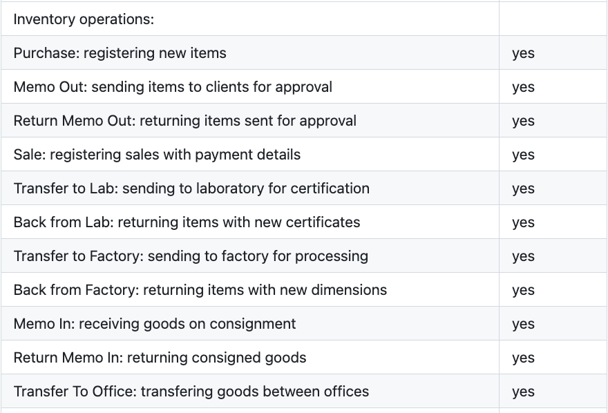
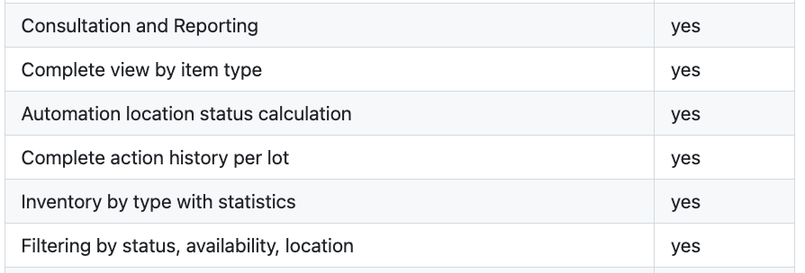
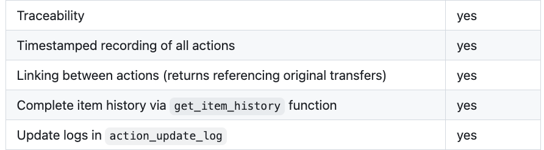
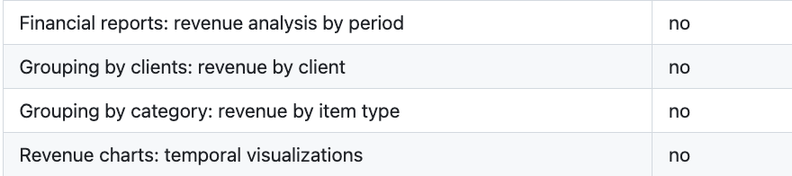
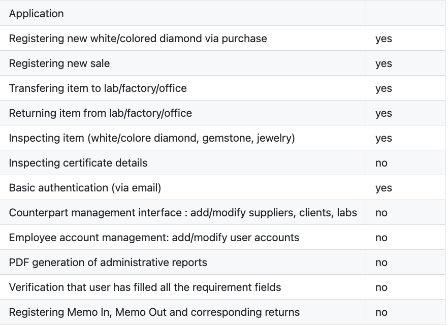

# Inventory management system for diamonds, colored stones, and jewelries

## Authors: Liao Pei-Wen, Makovskyi Maksym, Wu Guo Yu

---

# What problem we are trying to solve ? (1)

Companies in the diamond and precious stone sector face several operational challenges:

- Paper-based processes that create delays and errors.
- Fragmented spreadsheets create duplicates, slow searches, and inventory errors.
- Limited traceability (certificates, provenance) increases audit and compliance risk.

---

# What problem we are trying to solve ? (2)

### Lot Concept

- either a single diamond or gemstone
- or a single piece of jewelry.

Each lot is characterized by:

- A controlled status, belonging to a predefined and validated set of states
- A current location, which may be an internal office or an external partner
- An item category (diamond, gemstone, or jewelry)
- A purchase date and, when applicable, a sale date
- A linked counterparty (supplier, client, laboratory, or manufacturer)
- Financial information associated with the lot through commercial documents

---

# What problem we are trying to solve ? (3)

### Inventory Lifecycle is driven by real world operations

- Purchase Note
- Memo In
- Return Memo In
- Memo Out
- Return Memo Out
- Transfer records
- Return Transfer records
- Invoice

---

# Conceptual schema (1)

action inheretance

--- 

# Conceptual schema (2)

item inheretance

---

# Conceptual schema (3)

Return style actions

---

# Conceptual schema (4)

Link between Action and Item

---

# Conceptual schema (5)

Link between Counterpart and Account type

---

# Conceputal schema (6)

Employee and Action

---

# Conceptual schema (7)

Certificate

---

# Relation schema (1)

Item inheretance transaltion

---

# Relation schema (2)

Action inheretance transaltion

---

# Relation schema (3)

Return style actions

---

# Relation schema (4)

ActionItem relation

---

# Relation schema (5)

Employee and Action

---

# Relation schema (6)

Counterpart and Account Type

---

# Relation schema (7)

Certificate

---

# SQL (1)

View to look at some type of inventory

--- 

# SQL (2)

View to look at the inventory by type

---

# SQL (3)

Trigger 1 to keep tract availability and location

---

# SQL (4)

Trigger 7 to check what items are being returned

---

# SQL (5)

Trigger 11 to invalidate the certificates after return from fac

---

# SQL (6)

Make a purchase procedure

---

# SQL (7)

Find all availible items at office

`database.item.item.py:get_items_stored_in_office`

---

# Tech stack

- Frontend: Streamlit
- Database: PostgreSQL 18
- Python: 3.13
- Package Manager: uv
- Container: Docker

---

 

# Demo

---

# Challanges

- Design document to Conceptual schema
- UI design (what a person who is going to be use it will need)
- Correcting item's data when item has undergone at least one action
- Correcting action's data if the it isn't the most recent action

---

# Implemented (or not) features

List of most important stuff

---

# Conclusion

- Modeling data is hard
- Processe in real life can have many little twists and caveats
- Conceptual (ER) phase maybe is the most important phase in the project

---

 

# Thank you for your attention !

