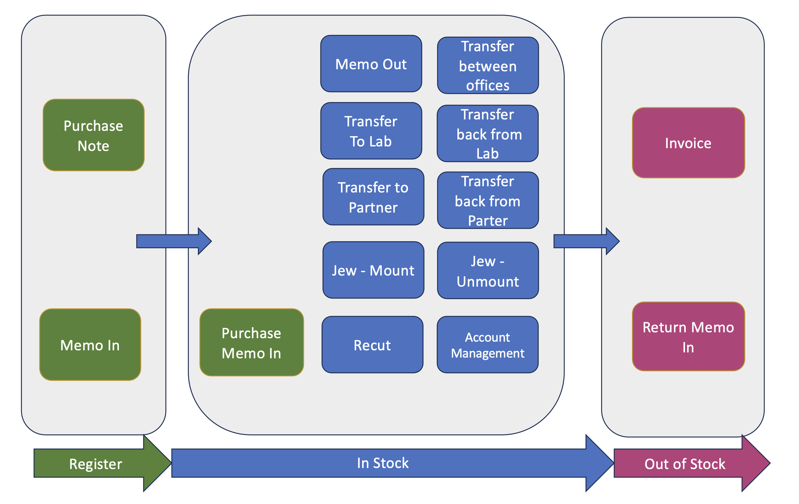
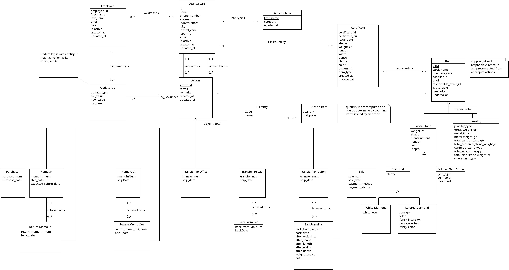
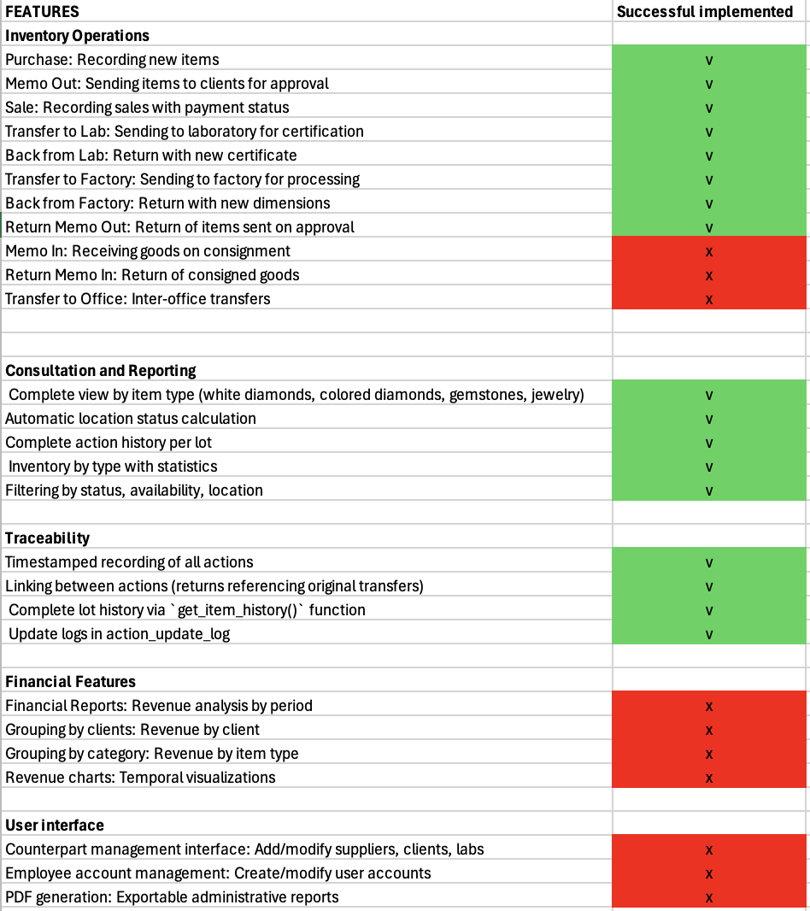

# Report - Inventory Management Tool For Diamond / Precious Stones

#####
member:  Liao Pei-Wen, Maksym Makovskyi, Wu Guo Yu

---

# Introduction / Conclusion

This project aims to develop a comprehensive inventory management system for the B2B diamond, gemstone, and jewelry trade.

Companies in the diamond and precious stone sector face several operational challenges:
- Paper-based processes (purchase notes, memos, transfers, invoices) create delays and errors.
- Fragmented spreadsheets create duplicates, slow searches, and inventory errors.
- Limited traceability (certificates, provenance) increases audit and compliance risk.

Therefore, the object of this project is to : 
- Ensure end-to-end traceability with controlled and auditable state transitions
- Improve operational efficiency from receiving to certification to listing, reducing discrepancies and increasing inventory turnover

---

# [Specification - Phase I ](../specs/specs.md)

## 1.Introduction :

### 1.1 Product :
The proposed system is a secure inventory management and traceability platform dedicated to diamonds, colored stones, and jewelry.
It acts as a centralized and reliable source of information for identifying, tracking, and managing goods throughout their lifecycle.

### 1.2 Business Problem:
- Paper-based processes (purchase notes, memos, transfers, invoices) create delays and errors.
- Fragmented spreadsheets create duplicates, slow searches, and inventory errors.
- Limited traceability (certificates, provenance) increases audit and compliance risk.

### 1.3 Goal :
The objective of this project is to design an inventory management system that:
- Ensure end-to-end traceability with controlled and auditable state transitions
- Improve operational efficiency from receiving to certification to listing, reducing discrepancies and increasing inventory turnover

---
## 2. User Profile 

### 2.1 target market :
- **Company type :** Colored stones / Dimond Dealer in B2B
- **Geographical scope:** worldwide
- **Language :** English

### 2.2 User roles:
- **Chief :** Full access to all system data and functionalities
- **Administrator :** Tracking goods' overall status, generating inventory list, following shipment
- **Sales :** Requires fast and accurate access to up-to-date inventory information
- **Accountant :** Handle AR/AP and reconsiliation. Need consistent documents, clean links between goods and invoice + reliable exports/ import.

---
## 3. Analysis of Data needs

The company manages high-value inventory composed of **diamonds**, **gemstones**, and **jewelry**.
Each physical item is managed individually in order to ensure precise traceability and certification control.
Although this project models a single company, the system must support operations across **multiple offices** and interactions with **external partners**, including suppliers, laboratories, and manufacturers.

### 3.1 Lot Concept
Each physical inventory unit is managed as a **Lot**.
A lot represents **exactly one physical object**:
- either a **single diamond or gemstone**, or
- a **single piece of jewelry**.

Each lot is uniquely identified within the system and associated with a stock reference.
Lots are not grouped or batched.

Each lot is characterized by:
- A controlled **status**, belonging to a predefined and validated set of states
- A current **location**, which may be an internal office or an external partner
- An **item category** (diamond, gemstone, or jewelry)
- A **purchase date** and, when applicable, a **sale date**
- A linked **counterparty** (supplier, client, laboratory, or manufacturer)
- Financial information associated with the lot through commercial documents

Financial information is not stored directly on the lot.
Prices and currencies are associated with a lot only through commercial documents such as purchases or sales. In this project, we **do not tracking the changes of market values** during the goods' life cycle.

### 3.2 Product-Specific Characteristics

- **Diamond lots** are described using gemological attributes such as shape, color characteristics (including white or fancy color scales), clarity, possible origin, and physical dimensions.
  A diamond lot may be associated with **one or more laboratory certificates**, allowing for re-certification while preserving historical records.

- **Gemstone lots** include information such as gem type, shape, color, treatment, possible origin, and physical dimensions.
  Certification information may be associated when available.

- **Jewelry lots** describe a single finished or semi-finished jewelry piece.
  They include jewelry type, composition of center and side stones (types, quantities, and weights), metal type, metal weight, and gross weight.
  Jewelry lots may reference associated stones for traceability purposes.

### 3.3 Parties and Users

The system manages several types of parties involved in inventory operations:
- **Suppliers**
- **Clients**
- **Offices**
- **Service partners**, such as laboratories and manufacturers

Each party stores legal identification data, contact information, and operational references required for business transactions.

User accounts are defined by roles (Chief, Administrator, Sales, Accountant).
Users may be associated with a specific office or party in order to determine access rights and operational responsibilities.

### 3.4 Inventory Lifecycle

The lifecycle of each lot is driven by business documents that represent real-world operations:

- A **Purchase Note** records the acquisition of goods from a supplier and introduces owned goods into inventory.

- A **Memo In** records goods received on consignment, where **ownership remains with the counterparty**.

- A **Return Memo In** records the return of consigned goods to the **counterparty** while preserving traceability.

- A **Memo Out** records goods sent to a **client or partner** for approval, during which the goods are **not available** for sale.

- A **Return Memo Out** records the return of goods previously sent on approval, restoring their **availability**.

- A **Transfer** records the movement of goods between **offices** or external partners for processing or services such as certification (**lab**) or recutting (**factory**).

- A **Return Transfer** records the receipt of goods between **offices** or following external processing and may result in updated characteristics or certification(**lab or factory**).

- An **Invoice** confirms a sale, transfers ownership to the client, and closes the commercial lifecycle of the lot.

---
## 4. Functional Requirements

This section describes the expected functionalities of the system.
Each functionality corresponds to a real operational need and is enforced by the system to guarantee data consistency, traceability, and reliability.

### 4.1 Inventory Management

- The system shall allow the creation of inventory records for diamonds, gemstones, and jewelry.
- Each inventory record shall represent a single physical object and be uniquely identifiable.
- The system shall allow consultation of inventory items based on their status, location, category, and characteristics.
- The system shall prevent the grouping or splitting of inventory items.

### 4.2 Lot Status and Location Management

- The system shall manage a controlled lifecycle for each inventory item.
- Each item shall always have exactly one valid status and one valid location.
- The system shall allow status and location changes only through authorized operations.
- Invalid or incoherent status transitions shall be rejected.

### 4.3 inventory operations

- The system shall support inventory operations driven by business documents, including:
  - purchase of goods
  - receipt of goods on consignment
  - return of consigned goods
  - sending goods for approval
  - return of goods from approval
  - transfer of goods for external services
  - return of goods after external services
  - sale of goods
- Each document shall result in a consistent update of the affected inventory items.

### 4.4 Certification Management

- The system shall allow association of inventory items with laboratory certificates.
- For this project, The system shall support **at most 1 single certificates for a single item** over time.
- Certification history shall be preserved to ensure traceability and auditability.

### 4.5 Traceability and History

- The system shall record all inventory operations in a traceable manner.
- For each operation, the system shall preserve:
  - the previous and new **status** of the item
  - the previous and new **location** of the item
  - the **user** responsible for the operation
  - the business context of the operation
  - the **date and time** of the operation
- The system shall allow reconstruction of the complete lifecycle of any inventory item.

### 4.6 Data Validation and Consistency

- The system shall enforce the use of controlled reference values for key attributes such as:
  - **statuses**
  - **item type**
  - **shape**
  - **colors and clarity**
  - **treatments**
  - **laboratories and service partners**
- The system shall prevent the storage of incomplete or inconsistent data.
- Operations violating business rules or lifecycle constraints shall be rejected.

### 4.7 User Roles and Responsibilities

- The system shall support multiple user roles with different responsibilities.
- The system shall restrict operations based on user roles.
- All operations affecting inventory shall be attributable to a specific user.

### 4.8 Financial Information Handling

- The system shall allow association of prices and currencies with inventory items through commercial documents.
- Financial information shall be linked to the context of the operation (purchase or sale).
- The system shall not allow direct modification of financial values outside of document-based operations.

---

# Conceptual Schema - Phase 2 

#### Description

Given conceptual design is mainly based around idea of a lifecycle.  
Every item that arrives does not appear from nothing, it has some provenance, certification etc.  
As well every movement (we call it action) that item undergoes should be reflected in the system 
for answering the questions: What?, Why? and When?

---

# [Relational Schema -  Phase 3](../diagram/er_to_relational.md)

After translating ER schema to the Relational, we have got the following relations:

#### `currency`

currency (**code**, name)

#### `counterpart` related relations

counterpart (**counterpart_id**, name, phone_number, address_short, city, postal_code, country, email, is_active, created_at, updated_at)

account_type (**type_name**, category, is_internal)

counterpart_account_type (**counterpart_id, type_name**)  
    `counterpart_id` references `counterpart.counterpart_id`  
    `type_name` references `account_type.type_name`

#### `employee`

employee (**employee_id**, counterpart_id, first_name, last_name, email, role, is_active, created_at, updated_at)  
    `counterpart_id` references `counterpart.counterpart_id` NOT NULL

#### `action`

action (**action_id**, from_counterpart_id, to_counterpart_id, terms, remarks, created_at, updated_at, action_category)  
    `from_counterpart_id` references `counterpart.counterpart_id` NOT NULL  
    `to_counterpart_id` references `counterpart.counterpart_id` NOT NULL  

#### `action_update_log`

action_update_log (**log_time, action_id**, employee_id, update_type, old_value, new_value, log_time)  
    `action_id` references `action.action_id`  
    `employee_id` references `employee.employee_id` NOT NULL

#### `item` related relations

item (**lot_id**, stock_name, purchase_date, supplier_id, origin, responsible_office_id, created_at, updated_at, is_available, item_type)  
    `supplier_id` references `counterpart.counterpart_id` NOT NULL
    `responsible_office_id` references `counterpart.counterpart_id` NOT NULL

action_item(**action_id, lot_id**, price, currency_code)  
   `action_id` references `action.action_id`  
   `lot_id` references `item.lot_id`  
   `currency_code` references `currency.code` NOT NULL

#### All the types of action

purchase(**action_id**, purchase_num, purchase_date)  
    `action_id` references `action.action_id`

memo_in (**action_id**, memo_in_num, ship_date, expected_return_date)  
    `action_id` references `action.action_id`

return_memo_in (**action_id**, orig_transfer_id, return_memo_in_num, back_date)  
    `action_id` references `action.action_id`  
    `orig_transfer_id` references `memo_in.action_id` NOT NULL

memo_out(**action_id**, memo_out_num, ship_date, expected_return_date)  
    `action_id` references `action.action_id`

return_memo_out(**action_id**, orig_transfer_id, return_memo_out_num, back_date)  
    `action_id` references `action.action_id`  
    `orig_transfer_id` references `memo_out.action_id` NOT NULL

transfer_to_office(**action_id**, transfer_num, ship_date)  
    `action_id` references `action.action_id`

transfer_to_lab(**action_id**, transfer_num, ship_date, lab_purpose)  
    `action_id` references `action.action_id`

back_from_lab(**action_id**, orig_transfer_id, back_from_lab_num, back_date, new_certificate_num)   
    `action_id` references `action.action_id`  
    `orig_transfer_id` references `transfer_to_lab.action_id` NOT NULL  
    `new_certificate_num` references `certificate.certificate_num` NOT NULL

transfer_to_factory(**action_id**, transfer_num, ship_date, processing_type)  
    `transfer_to_factory.action_id` references `action.action_id`

back_from_factory(**action_id**, orig_transfer_id, back_from_fac_num, back_date, before_weight_ct, before_shape, before_length, before_width, before_depth, after_weight_ct, after_shape, after_length, after_width, after_depth, weight_loss_ct, note)  
    `action_id` references `action.action_id`  
    `orig_transfer_id` references `transfer_to_factory.action_id` NOT NULL

sale(**action_id**, sale_num, sale_date, payment_method, payment_status)  
    `action_id` references `action.action_id`

#### All the types of `item`

loose_stone (**lot_id**, weight_ct, shape, length, width, depth)  
    `lot_id` references `item.lot_id`

white_diamond (**lot_id**, white_level, clarity)  
    `lot_id` references `loose_stone.lot_id`

colored_diamond (**lot_id**, gem_type, fancy_intensity, fancy_overton, fancy_color, clarity)  
    `lot_id` references `loose_stone.lot_id`

colored_gem_stone (**lot_id**, gem_type, gem_color, treatment)  
    `lot_id` references `loose_stone.lot_id`

jewelry (**lot_id**, jewerly_type, gross_weight_gr, metal_type, metal_weight_gr,
total_center_stone_qty, total_center_stone_weight_ct, centered_stone_type,
total_side_stone_qty, total_side_stone_weight_ct, side_stone_type)   
    `lot_id` references `item.lot_id`

#### `certificate`

certificate(**certificate_num**, lot_id, lab_id, issue_date, shape, weight_ct, length, width, depth, clarity, color, treatment, gem_type, is_valid, created_at, updated_at)  
    `lot_id` references `item.lot_id` NOT NULL  
    `lab_id` references `counterpart.counterpart_id` NOT NULL

---

##  Encountered Challenge 

1. Database Schema Design: 

    The biggest challenge was converting the requirements document into a working Entity-Relationship schema. 
    We actually went back and forth many times to modify the schema. 
    This was critical because the ER schema affects every design decision and code implementation throughout the project. 
    Key difficulties included modeling complex relationships between items, actions, and counterparts, implementing SQL inheritance (Item → Loose_Stone → specific stone types), and designing action traceability where actions reference each other (e.g., returns linking to original transfers).

2. User Interface Development with Streamlit: 

    As we are not familiar with developing the application interface with Python and Streamlit, this part took us a lot of time to complete.

3. Project Scope Reduction : 

    Time constraints forced us to prioritize features. 
    We deferred some planned functionality (memo in/out, financial reports, admin interfaces) and focused on essential operations: purchase, memo out, sale, and lab/factory transfers. 
    We also simplified some features, like limiting to one valid certificate per item although the system supports multiple.

---

## 5. List of Functions 

---- not completed yet, there is excel, please douuble check and update 

| Feature                                         | Imlemented |
|-------------------------------------------------|------------|
| Inventory operations:                           |            | 
| Purchase: registering new items                 | yes        | 
| Memo Out: sending items to clients for approval | yes        | 
| Sale: registering sales with payment details    | yes        | 

---

## 6. Confirmed Bugs 

Currently, no critical bugs identified in the database or stored procedures. Tests performed have not revealed inconsistencies in:

- Status management
- Availability updates
- Location calculations
- Referential integrity

## Known Limitations

As some decisions during the Conceptual Schema phase were made,
even registering new purchases with this schema is not easy at all,
there are so many intersecting options that such a simple action
suddenly run into combinatorial explosion.

Besides, deleting or updating `action` or `item` (with `white_deamond/colored_diamond/colored_gemstone/jewelry` underneath)
can be a problem since an idea of the current design is to reflect every change via a new `action`.
But what happens if someone mistypes a measurement, and then the item undergoes several `action`s?
How this problem can be solved when every new action relies on the previous one?
There is no answer to this in the current design. 
Probably for correct someone's error we should introduce some new `action` (`Correction` for example)
that would deal with this kind of situation.  
For now, delete or updating has sense only if `item` has just "arrived" in the DB,
or if the action of our interest is the last one in some lifecycle.

---

## 7. Members contribution 

- Liao Pei-Wen (requirements document, ER design, SQL schema design, dummy data, views, procedures, application)
- Makovskyi Maksym (ER design, SQL schema, dummy data, triggers, queries, application)
- 

## 8. App interface with screenshot 

